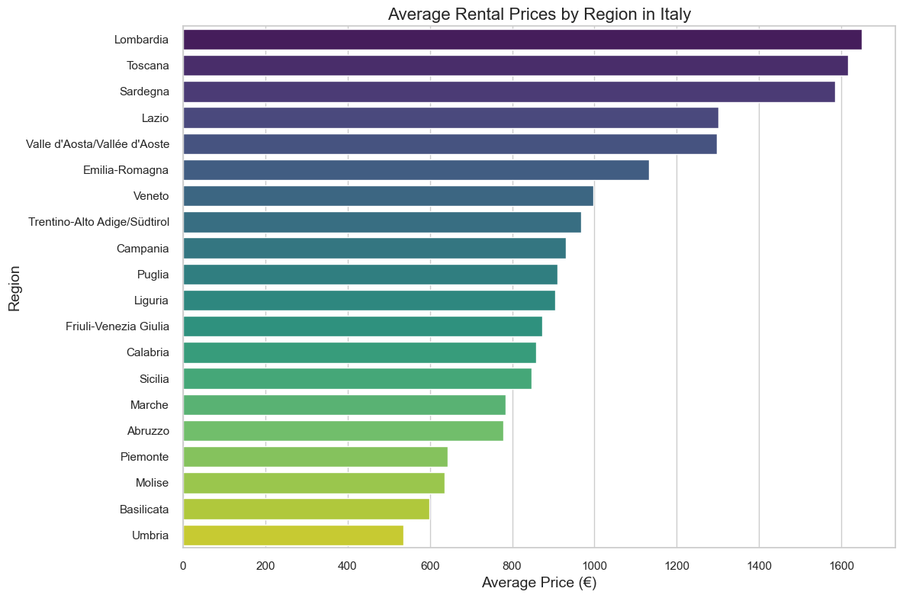
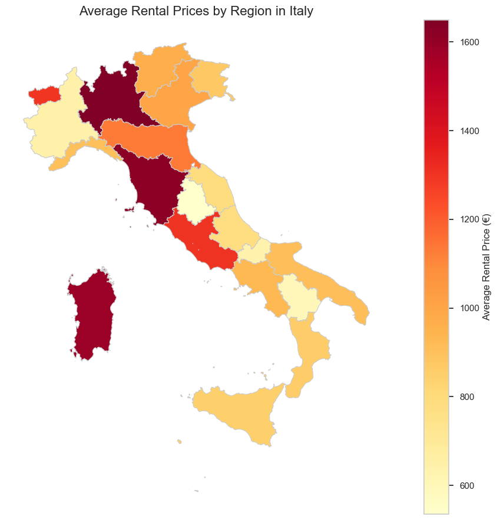
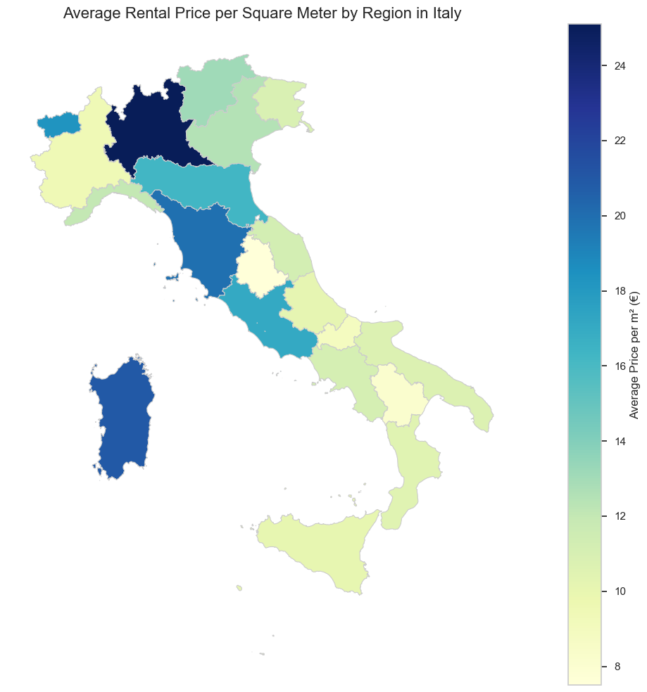
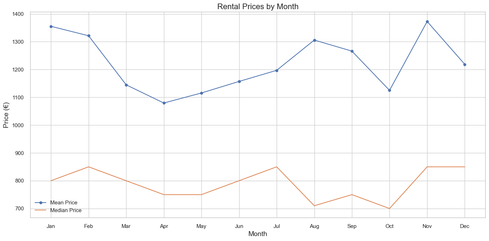
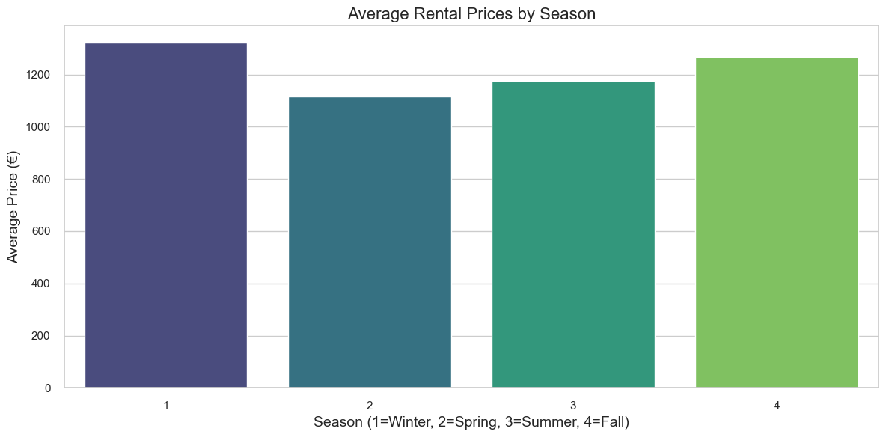
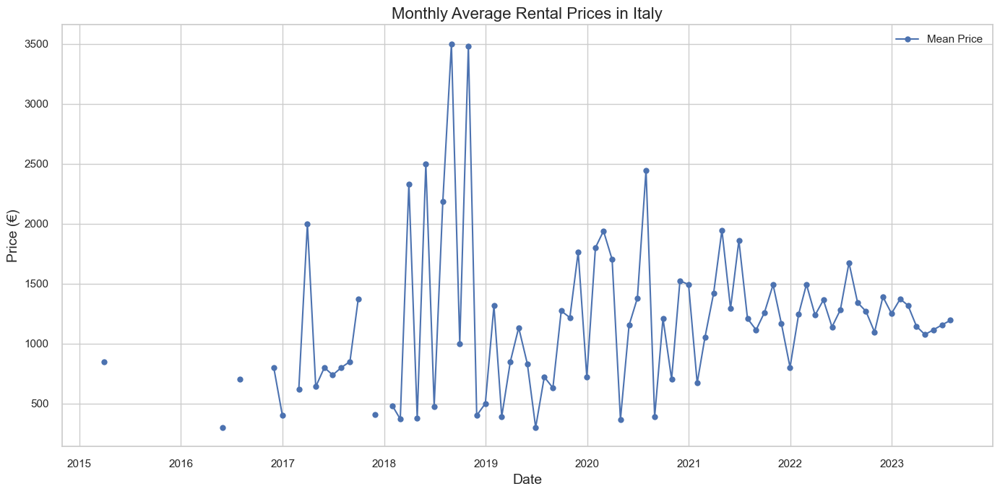
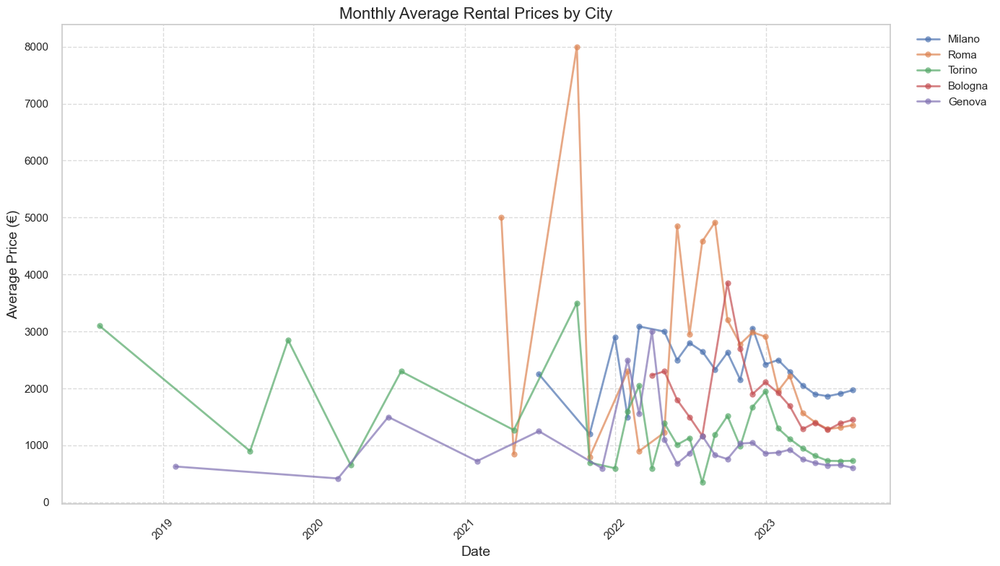

## Table of Contents
- [The Journey Behind the Numbers](#the-journey-behind-the-numbers)
- [1. Project Overview](#1-project-overview)
- [2. Data Overview: From Raw Listings to Insights](#2-data-overview-from-raw-listings-to-insights)
  - [The Data Source](#the-data-source)
  - [Raw Data Overview](#raw-data-overview)
  - [Cleaned Data Overview](#cleaned-data-overview)
  - [The Data Cleaning Process](#the-data-cleaning-process)
- [3. Geographic Analysis: Mapping Italy's Rental Landscape](#3-geographic-analysis-mapping-italys-rental-landscape)
  - [Interactive Choropleth Map](#interactive-choropleth-map)
  - [Regional Price Comparison](#regional-price-comparison)
  - [Static Choropleth Map](#static-choropleth-map)
  - [Price Efficiency Analysis](#price-efficiency-analysis)
- [4. Time Series Analysis: Uncovering Market Dynamics](#4-time-series-analysis-uncovering-market-dynamics)
  - [Monthly Price Patterns](#monthly-price-patterns)
  - [Seasonal Analysis](#seasonal-analysis)
  - [Long-Term Market Trends](#long-term-market-trends)
  - [City-Specific Dynamics](#city-specific-dynamics)
- [5. Rentelligence AI: Your Italian Rental Market Navigator](#5-rentelligence-ai-your-italian-rental-market-navigator)
  - [Interactive Exploration](#interactive-exploration)
  - [Smart Price Prediction](#smart-price-prediction)
  - [Try It Yourself](#try-it-yourself)
  - [Future Directions](#future-directions)

## The Journey Behind the Numbers

<table>
  <tr>
    <td style="vertical-align: top; width: 50%;">
      
Have you ever moved to a new city and wondered if you're paying too much for rent? That question hit me when I was planning a move to Italy. With rental prices varying wildly across different regions and cities, I needed a way to cut through the confusion and find fair prices.

      
That's how Rentelligence AI was born - a data science project that turned into a practical tool for anyone navigating the Italian rental market. What started as a personal quest to understand fair rental prices evolved into a comprehensive analysis of over 20,000 listings across the country, revealing fascinating patterns about how location, timing, and property features influence what Italians pay for housing.

      
Whether you're a renter wondering if you're getting a fair deal, a property owner trying to set the right price, or a newcomer to Italy facing an unfamiliar market, this tool provides data-driven insights to help you make informed decisions. It's also valuable for investors seeking the best rental returns and anyone curious about Italy's diverse housing landscape, from the expensive financial hub of Milan to the charming, affordable towns of southern Italy.

      

        <a href="https://rentelligence-ai.streamlit.app" style="display: inline-block; background-color: #FF4B4B; color: white; padding: 8px 16px; text-decoration: none; border-radius: 8px; font-weight: bold; margin-top: 10px; box-shadow: 0 2px 5px rgba(0,0,0,0.1); transition: all 0.3s ease;">
          ✨ Try Rentelligence AI
        </a>
      

    </td>
    <td style="vertical-align: top;">
      

        
      

    </td>
  </tr>
</table>

## 1. Project Overview

<table>
  <tr>
    <td style="vertical-align: top; width: 50%; padding-right: 20px;">
      
Rentelligence AI is a machine learning application that predicts rental prices for properties across Italy. It combines geographic data visualization with predictive modeling to help users:

      <ul>
        <li>Explore average rental prices across different Italian regions</li>
        <li>Get personalized price estimates based on property features</li>
        <li>Make more informed decisions when searching for rentals</li>
      </ul>
      
The project uses XGBoost regression to deliver accurate price predictions based on location, property size, amenities, and other key features.

      
<strong>Tech Stack:</strong>

      <ul>
        <li>Python (pandas, numpy, scikit-learn, XGBoost)</li>
        <li>Streamlit for the web application</li>
        <li>GeoPandas and Folium for geographic visualization</li>
        <li>Docker for containerization</li>
      </ul>
    </td>
    <td style="vertical-align: top;">
      

        
      

    </td>
  </tr>
</table>

## 2. Data Overview: From Raw Listings to Insights

### The Data Source

Our journey began with a dataset of over 20,000 Italian rental listings from Kaggle (https://www.kaggle.com/datasets/tommasoramella/italy-house-prices). This comprehensive collection of rental data was scraped from major Italian real estate platforms, providing us with a rich foundation for our analysis.

Each listing included details like:
- Location (region, city)
- Property features (area, bedrooms, bathrooms)
- Building characteristics (floor, elevator access)
- Amenities (balcony, parking, furnishings)
- Price (our target variable)

We're grateful to Tommaso Ramella for compiling and sharing this valuable dataset, which made our analysis possible.

### Raw Data Overview

Before diving into cleaning, here's what the raw dataset looked like:

| Column Name | Description | Sample Value |
|-------------|-------------|-------------|
| prezzo | Monthly rental price in Euros | 1.800/mese |
| stanze | Number of rooms in the property | 3 |
| m2 | Property area in square meters | 60m² |
| bagni | Number of bathrooms | 1 |
| piano | Floor number and elevator availability | 9°, con ascensore |
| description | Detailed text description of the property | Piazza San Camillo De Lellis, nella signorile... |
| Riferimento e Data annuncio | Reference ID and listing date | ADR9 - 07/03/2023 |
| contratto | Contract type (e.g., "Affitto" = Rent) | Affitto, libero |
| tipologia | Property type (e.g., Apartment, House) | Appartamento, Intera proprietà |
| superficie | Surface area with commercial measurements | 60 m², commerciale 68 m² |
| locali | Detailed breakdown of rooms and layout | 3 (2 camere da letto, 1 altro), 1 bagno |
| totale piani edificio | Total floors in the building | 10 piani |
| Posti Auto | Parking spaces available | 1 in garage/box |
| disponibilità | Availability status | Libero |
| citta | City where property is located | Milano |
| quartiere | Neighborhood within the city | Centrale |
| href | URL link to the original listing | https://www.immobiliare.it/annunci/101614827/ |
| via | Street address | Via Antonio da Recanate |
| spese condominio | Monthly building maintenance fees | € 120/mese |
| anno di costruzione | Year of construction | 1960.0 |
| stato | Property condition (e.g., "Ottimo" = Excellent) | Ottimo / Ristrutturato |
| riscaldamento | Heating system type | Autonomo, a radiatori, alimentato a metano |
| Climatizzatore | Air conditioning information | Autonomo, freddo/caldo |
| Efficienza energetica | Energy efficiency rating | E132.32 kWh/m² anno |
| regione | Region of Italy where property is located | Lombardia |

### Cleaned Data Overview

After our extensive data cleaning process, here's how the structured dataset looked:

| Column Name | Description | Sample Value | Transformation Applied |
|-------------|-------------|-------------|------------------------|
| date_posted | Listing date | 2023-03-07 | Standardized date format |
| year | Year of listing | 2023 | Extracted from date |
| month | Month of listing | 3 | Extracted from date |
| season | Season of listing | 2 (Spring) | Derived (0=Winter, 1=Spring, etc.) |
| city | Standardized city name | Milano | Normalized spelling |
| neighborhood | Neighborhood within city | Centrale | Preserved when available |
| region | Standardized region name | lombardia | Matched to official names |
| price | Monthly rental price in Euros | 1800.0 | Extracted numeric value from text |
| price_per_m2 | Price per square meter | 30.0 | Calculated metric |
| area | Property area in square meters | 60.0 | Standardized numeric format |
| bathrooms | Number of bathrooms | 1.0 | Converted to numeric |
| floor | Floor number | 9.0 | Extracted numeric value |
| total_floors | Total floors in building | 10.0 | Standardized format |
| parking_spaces | Number of parking spaces | 1 | Standardized count |
| num_bedrooms | Number of bedrooms | 2.0 | Extracted from room descriptions |
| num_living_rooms | Number of living rooms | 1.0 | Extracted from descriptions |
| total_rooms | Total number of rooms | 3.0 | Standardized count |
| energy_value | Energy consumption value | 132.32 | Extracted numeric value |
| energy_class | Energy efficiency rating | E | Standardized classification |
| room_to_bathroom_ratio | Rooms per bathroom | 3.0 | Engineered feature |
| floor_to_height_ratio | Relative floor position | 0.9 | Engineered feature |
| bedroom_ratio | Proportion of bedrooms to total rooms | 0.667 | Engineered feature |
| has_elevator | Elevator availability | 1 | Converted to binary indicator |
| has_furnished | Furnished status | 1 | Converted to binary indicator |
| has_balcony | Balcony availability | 0 | Extracted from descriptions |
| has_tv_system | TV system availability | 1 | Extracted from descriptions |
| has_external_exposure | External exposure availability | 0 | Extracted from descriptions |
| has_fiber_optic | Fiber optic internet availability | 1 | Extracted from descriptions |
| has_electric_gate | Electric gate availability | 0 | Extracted from descriptions |
| has_cellar | Cellar availability | 0 | Extracted from descriptions |
| has_shared_garden | Shared garden availability | 0 | Extracted from descriptions |
| has_private_garden | Private garden availability | 0 | Extracted from descriptions |
| has_doorman | Doorman availability | 0 | Extracted from descriptions |
| has_pool | Pool availability | 0 | Extracted from descriptions |
| is_villa | Property is a villa | 0 | Derived from descriptions |
| is_apartment | Property is an apartment | 1 | Derived from descriptions |
| is_penthouse | Property is a penthouse | 0 | Derived from descriptions |
| is_loft | Property is a loft | 0 | Derived from descriptions |
| is_mansard | Property is a mansard | 0 | Derived from descriptions |

### The Data Cleaning Process

Transforming the raw Italian rental listings into a structured dataset involved several key steps. Here is a brief overview of the cleaning process:

1. **Date Standardization**: Converted inconsistent date formats into a standard YYYY-MM-DD format and extracted temporal features like `year`, `month`, and `season`.

2. **Text Extraction**: Used regular expressions and string parsing to extract numeric values from text fields (e.g., "1.800/mese" → `1800.0`).

3. **Location Normalization**: Standardized `city` and `region` names to handle variations in spelling and language (e.g., "Milano" vs "Milan").

4. **Feature Engineering**: Created calculated fields like `price_per_m2`, `room_to_bathroom_ratio`, and `floor_to_height_ratio` to capture property value metrics.

5. **Binary Feature Creation**: Transformed descriptive text into binary indicators (0/1) for 15+ amenities and property characteristics like `has_elevator`, `has_balcony`, and `has_furnished`.

6. **Property Type Classification**: Identified property types (`is_apartment`, `is_villa`, `is_penthouse`, etc.) from unstructured descriptions.

7. **Room Count Parsing**: Split generic "rooms" counts into specific categories like `num_bedrooms` and `num_living_rooms`.

8. **Missing Value Handling**: Applied domain-specific imputation techniques to reduce missing values from 45% to under 5%.

9. **Outlier Detection**: Identified and addressed extreme values, particularly in `price` and `area` fields.

10. **Data Validation**: Implemented logical checks to ensure data consistency (e.g., `num_bedrooms` ≤ `total_rooms`).

This process transformed a messy, inconsistent dataset into a clean, structured format ready for analysis and modeling, with 38 well-defined features for each property.

## 3. Geographic Analysis: Mapping Italy's Rental Landscape

One of the most illuminating aspects of this project was visualizing how rental prices vary across Italy's diverse regions.

### Interactive Choropleth Map

Using GeoPandas and Folium, we created an interactive choropleth map that shows:
- Average rental prices by region
- Median prices (to account for outliers)
- Property count (to understand market activity)

### Regional Price Comparison

  

The chart shows that there are essentially two rental markets in the country.

Northern powerhouse Lombardia tops the chart at over €1600, where Milan's bustling financial district drives prices skyward. The picturesque hills of Toscana follow closely behind, where renters pay a premium for those postcard-perfect views.

Surprisingly, island life in Sardegna comes with a hefty price tag too, challenging the notion that coastal living is more affordable.

The middle of the chart tells the story of Italy's economic backbone, regions like Emilia-Romagna and Lazio, where history and commerce blend together in cities like Bologna and Rome.

As we move down the chart, we see rental prices gradually decline through the central and southern regions, with places like Umbria and Basilicata offering more budget-friendly options for those willing to trade big-city convenience for authentic Italian charm

### Static Choropleth Map

  

The map above clearly illustrates the concentration of high rental prices in northern regions like Lombardia and Toscana, as well as in Sardegna, while highlighting more affordable options in central and southern regions.

We can observe a clear split in Italy's rental prices:

- Northern Italy (Lombardia) has the highest rents (€1,649), with Milan being the most expensive city. Tuscany is also very expensive, as many tourists and foreigners want to live there.
- Sardinia island is surprisingly costly, not what you'd expect for island living.
- The middle of Italy shows medium prices, with Rome's region (Lazio) costing more than nearby areas.
- Southern Italy is much cheaper, with places like Umbria offering the lowest rents at just €535.

This map tells an old story about Italy: rich north, middle-priced center, and more affordable south, a pattern that has existed for many years.

### Price Efficiency Analysis

  

The price per square meter chart above reveals a different perspective on value. Lombardia stands out with the darkest blue, indicating renters pay over €24 per square meter, the highest in Italy. This efficiency metric highlights where renters get the least space for their money.

Interestingly, while Sardegna has high overall prices, its price per square meter is more moderate, suggesting larger properties. Toscana and Lazio also demand premium rates per square meter, reflecting the high demand in Florence and Rome.

The lighter shades across southern Italy confirm these regions offer not just lower absolute prices but also better value in terms of space, often below €10 per square meter.

## 4. Time Series Analysis: Uncovering Market Dynamics

Our temporal analysis revealed fascinating patterns in Italy's rental market that go beyond simple price listings. By examining data spanning several years, we uncovered several key insights:

### Monthly Price Patterns

  

The monthly price chart reveals clear seasonal patterns in Italy's rental market. Both mean and median prices follow similar trajectories throughout the year, with notable peaks in November-January and July-August. This dual-peak pattern reflects Italy's academic calendar and tourism seasons:

- **Winter Peak (November-January)**: Coincides with mid-year university enrollments and winter holiday rentals, pushing average prices to around €1,350
- **Summer Peak (July-August)**: Aligns with peak tourism season and fall semester university preparations, with mean prices reaching €1,300
- **Spring Dip (March-April)**: Offers the best value for renters, with prices dropping to their lowest point (around €1,080)

The consistent gap between mean and median prices (approximately €400-500) indicates the market contains high-value outliers that skew averages upward.

### Seasonal Analysis

  

Breaking down prices by season reveals that Winter (1) and Fall (4) command the highest rental prices in Italy, averaging over €1,250 per month. This contradicts the common assumption that summer would be the most expensive season.

The data shows:
- **Winter (1)**: Highest average prices at approximately €1,300
- **Fall (4)**: Second highest at around €1,250
- **Summer (3)**: Moderate prices at approximately €1,180
- **Spring (2)**: Most affordable season at about €1,120

This pattern suggests strategic timing for those planning moves to Italy, with potential savings of nearly 15% for renters who can arrange their relocations during spring months.

### Long-Term Market Trends

  

Our long-term analysis spanning from 2015 to 2023 reveals several critical market shifts:

- **Pre-2019 Volatility**: The market showed significant price instability with dramatic spikes reaching €3,500 in 2019
- **COVID-19 Impact**: Early 2020 saw a noticeable price correction followed by increased volatility
- **Stabilization Period**: From 2021 onward, prices have stabilized between €1,000-€1,500, with fewer extreme outliers
- **Gradual Uptrend**: Since 2022, we observe a slight but consistent upward trend, with average prices increasing approximately 5% annually

This stabilization suggests the market has matured after the pandemic disruption, providing more predictable conditions for both landlords and tenants.

### City-Specific Dynamics

  

Comparing major Italian cities reveals dramatically different rental markets and recovery patterns:

- **Roma**: Shows the highest volatility with dramatic spikes reaching €8,000 in 2021, likely reflecting luxury or short-term rental listings
- **Milano**: Maintains the most consistently high prices (€2,000-€3,000) with relatively lower volatility
- **Bologna**: Emerged as an increasingly expensive market post-2021, with prices occasionally surpassing €3,000
- **Torino**: Displays a cyclical pattern with prices generally ranging from €1,000-€2,000
- **Genova**: Consistently offers the most affordable options among major cities, rarely exceeding €1,000

The data reveals a "spillover effect" where secondary cities like Bologna have seen accelerated price growth as renters seek alternatives to the traditionally expensive markets of Milano and Roma.

These temporal insights proved crucial for our prediction model, allowing us to account for seasonal factors, long-term trends, and city-specific dynamics when estimating fair rental prices.

## 5. Rentelligence AI: Your Italian Rental Market Navigator

The culmination of this project is a user-friendly Streamlit application that makes all this analysis accessible to anyone planning a move to Italy or researching the Italian rental market.

### Interactive Exploration

The app's interactive map allows users to:
- Visualize rental price variations across all Italian regions with color-coded choropleth maps.
- Click on any region to see detailed statistics including average price, median price, and property count.
- Compare different regions side-by-side to identify affordable alternatives to high-cost areas.

### Smart Price Prediction

The heart of Rentelligence AI is its prediction engine, which uses our trained XGBoost model to:
- Generate personalized rental estimates based on 15+ property features.
- Provide confidence intervals to understand the potential price range.

Test set performance Metrics on original price scale (€):
- **MAE: €303.62** (Mean Absolute Error)
- **RMSE: €606.04** (Root Mean Squared Error)
- **R²: 0.7406** (Coefficient of Determination)

The model achieves an 82.32% confidence prediction level of 82.32% on test data, making it reliable enough for real-world use while acknowledging the inherent unpredictability of real estate markets.

### Try It Yourself

Experience Rentelligence AI firsthand and discover fair rental prices across Italy:
[Rentelligence AI App](https://rentelligence-ai.streamlit.app)

### Future Directions

This project is just the beginning. Future enhancements could include:
- Neighborhood-level predictions for major cities
- Integration with real-time listing APIs
- Price trend forecasting for investment planning
- Expansion to other European markets

If you're planning a move to Italy or just curious about rental prices there, give Rentelligence AI a try!

---

**GitHub Repository**: [GitHub](https://github.com/hamid701/rentelligence-ai)  
**Live Demo**: [Streamlit app](https://rentelligence-ai.streamlit.app)
